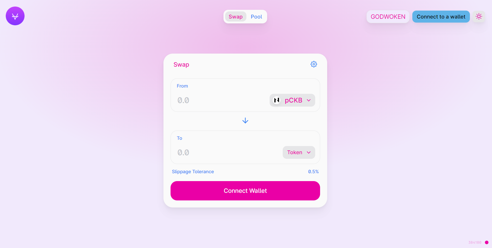
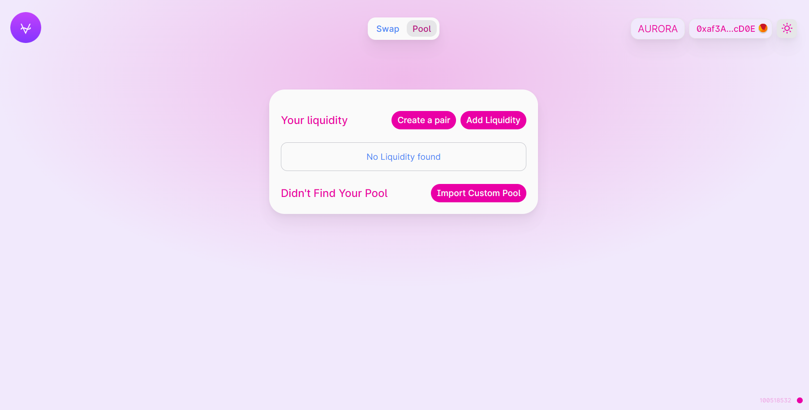

# fviveswap
A one point destination to swap your cryptos on five different blockchains

## FviveSwap Interface for for different blockchain networks





## Deploying the FviveSwap on local machine

Clone the repository

move into the polygon Directory for accessing FviveSwap on Poygon(Matic) Blockchain

```sh
cd polygon
```
or

move into the aurora_is_near Directory for accessing FviveSwap on Aurora(EVM Blockchain Layer for NEAR) Blockchain

```sh
cd aurora_is_near
``
or

move into the godwoken_is_nervos Directory for accessing FviveSwap on GodWoken(EVM Blockchain Layer for Nervos) Blockchain

```sh
cd godwoken_is_nervos
``

After moving into the desired blockchin directory move into the UserInterface Directory

```sh
cd UserInterface
```

install dependencies using **yarn** or **npm**

**having some dependency version problems in yarn, so advised to use npm commands instead**

```sh
yarn

or

npm install
```
If using Windows then run these two commmands after npm install

```sh
rm -r ./node_modules/@uniswap/sdk
```
And Then this command

```sh
cp -r ./forks/@uniswap/sdk ./node_modules/@uniswap/sdk
```

start the development server
```sh
yarn start

or

npm start
```

build with production mode
```sh
yarn build

or

npm run build
```